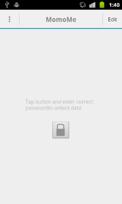
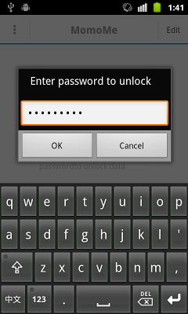
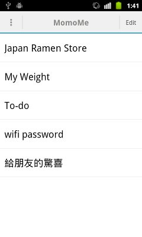

momome
======

An Android application which saves memo in List and protect it by password

Each time user leaves this app, the app will lock itself automatically. This app provides a simple user-interface with ListView, and user can save mome in it.

# Why this app

I encourage my wife to use different strong password for each web service, so she needs a way to remember those password. I created this simple app for her.

I also use this app to stores some sensitive information such as WiFi WPA passphrase.

Wish this app also helps you.

# Download

You and download this app from [Google Play](https://play.google.com/store/apps/details?id=org.zeroxlab.momome)

# Build

Use gradle as build system. Just git clone this project and execute below command.

    $ cd android
    $ cp local.properties.example local.properties  # then edit for SDK path
    $ ./gradlew --daemon build

